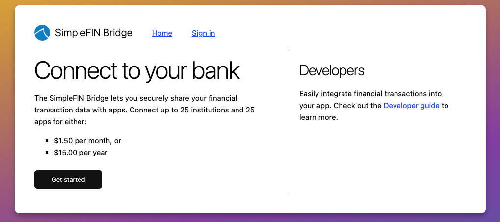
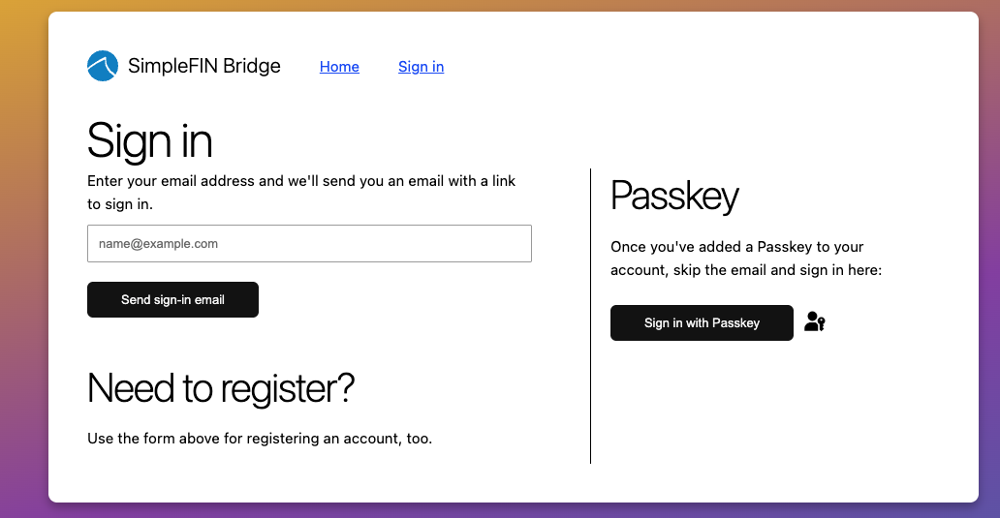
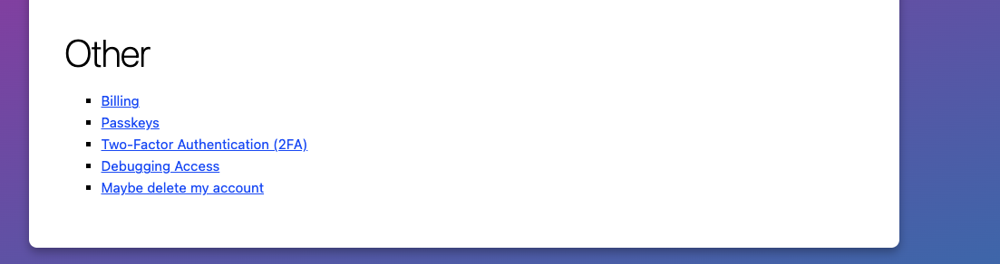
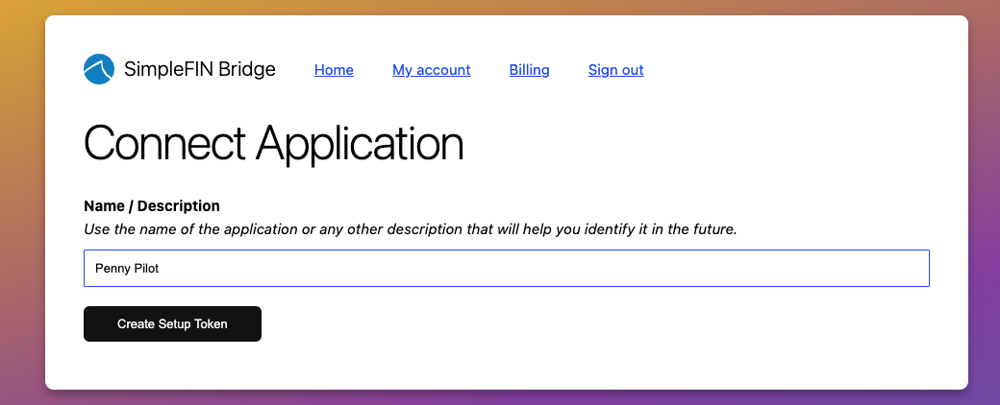

# Connecting Penny Pilot to SimpleFIN

To sync your bank accounts, you'll create a SimpleFIN Bridge account, authorize your banks there, generate a setup token, and then redeem that token inside Penny Pilot. This guide currently walks through the SimpleFIN side of setup (Steps 1–3). Steps 4–5 — linking inside Penny Pilot and verifying the initial sync — are coming in a follow-up.

The **setup token** you generate is single-use — if you need to re-link later, generate a fresh one.

## Step 1: Create a SimpleFIN Bridge account

Open [bridge.simplefin.org](https://bridge.simplefin.org/) in your browser. You'll land on the **Connect to your bank** page:

Click **Get started** to begin creating your account. (If you already have a SimpleFIN Bridge account, use **Sign in** in the top-right instead.)

A few things to know before you proceed:

- **Pricing:** SimpleFIN Bridge costs **$1.50/month or $15/year**. This is a SimpleFIN fee, not a Penny Pilot fee.
- **Connection limits:** A single account supports up to **25 financial institutions and 25 apps**.
- **Bank compatibility:** Not every bank is supported. Check the [Supported institutions](https://bridge.simplefin.org/info/supported) list in the site footer before paying if you're unsure your bank is covered.

### Register with your email

SimpleFIN Bridge uses passwordless, email-based authentication. After clicking **Get started**, you'll land on the sign-in / register page:

Enter your email address and click **Send sign-in email**. The same form is used for both new registrations and returning sign-ins — if no account exists for the address you enter, SimpleFIN will create one.

Check your inbox for a sign-in email from SimpleFIN and click the link it contains. You'll be taken to a **Finish signing in** confirmation page — click the button to complete the login.

> **Note:** The authentication code in the sign-in link is single-use. If you click it twice or the link expires, you'll need to request a new sign-in email.

### Recommended: enable a passkey and 2FA

Because SimpleFIN Bridge holds read-only credentials for your bank accounts, we strongly recommend hardening your SimpleFIN account immediately after first login. From the account page, scroll to the **Other** section:

Set up both:

- **Passkeys** — lets you sign in without waiting for an email each time, and is phishing-resistant.
- **Two-Factor Authentication (2FA)** — adds a second factor on top of email-based login.

These are optional from SimpleFIN's perspective but should be considered mandatory for any account connected to a financial aggregator.

## Step 2: Authorize your banks in SimpleFIN

From your SimpleFIN Bridge account page, click **New Connection** and follow the prompts:

1. **Subscribe** if you haven't already, and enter payment information. This is a one-time step — subsequent connections reuse the same subscription.
2. **Select your financial institution** from the list.
3. **Sign in to your bank** using your regular online banking credentials.

> **Privacy note:** Your bank credentials are entered directly into the SimpleFIN interface, not Penny Pilot. Penny Pilot never sees your username or password — only a read-only access URL that SimpleFIN issues after the connection succeeds.

Repeat this step for each institution you want to connect (up to 25). Once an institution is linked, its accounts will be available to any app that redeems a setup token from this SimpleFIN account.

> **If you see "We are upgrading this connection. Please wait..."** — this is a known SimpleFIN state where the Bridge is refreshing its integration with the institution. In most cases it resolves on its own; in some cases you'll need to delete and re-add the connection. See [Troubleshooting](#troubleshooting) for details.

## Step 3: Generate a setup token

The **setup token** is the one-time credential that Penny Pilot redeems to receive a long-lived, read-only access URL for your SimpleFIN accounts. Each token is bound to a single application — you'll generate a dedicated one for Penny Pilot.

From your SimpleFIN Bridge account page, navigate to the **Connect Application** screen:

1. Enter a **Name / Description** for this connection. We recommend `Penny Pilot` so you can identify it later if you need to revoke or rotate credentials.
2. Click **Create Setup Token**.

> **You may be prompted to re-authenticate with 2FA at this step.** SimpleFIN requires a second factor when issuing new credentials, even if you're already signed in. Complete the 2FA challenge to continue.

SimpleFIN will then display your setup token — a long base64-encoded string. **Copy it immediately** and keep it handy for the next step.

> **Important:** Setup tokens are **single-use**. Once Penny Pilot redeems the token in Step 4, it cannot be used again. If you lose the token before redeeming it, or if the redemption fails, return to this screen and generate a new one. The old token becomes inert.

---

> **Part 2 coming soon.** Steps 4 (link accounts in Penny Pilot) and 5 (initial sync and verification), along with Troubleshooting and Re-linking sections, will ship in a follow-up once the in-app linking flow is verified end-to-end on the homelab deployment.
